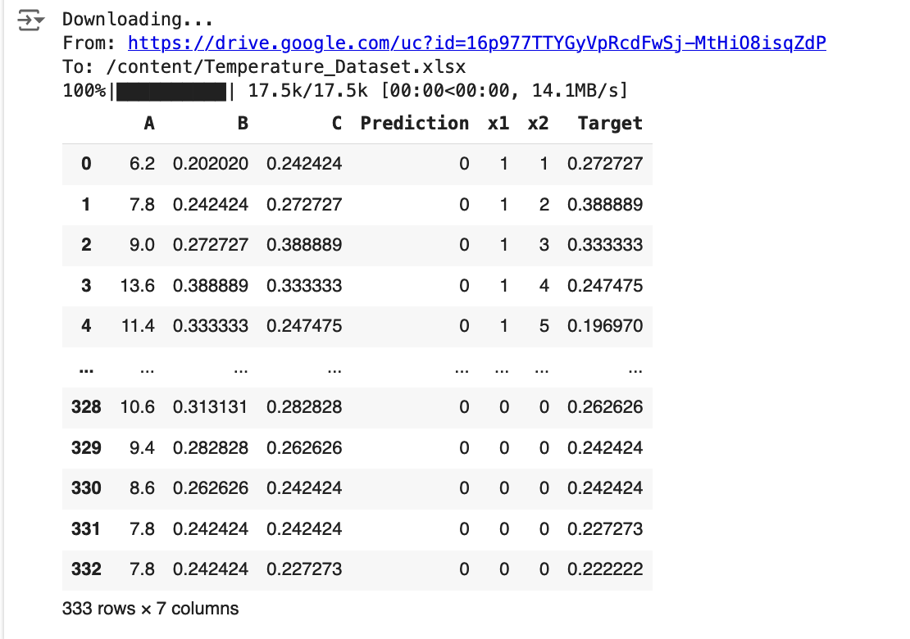
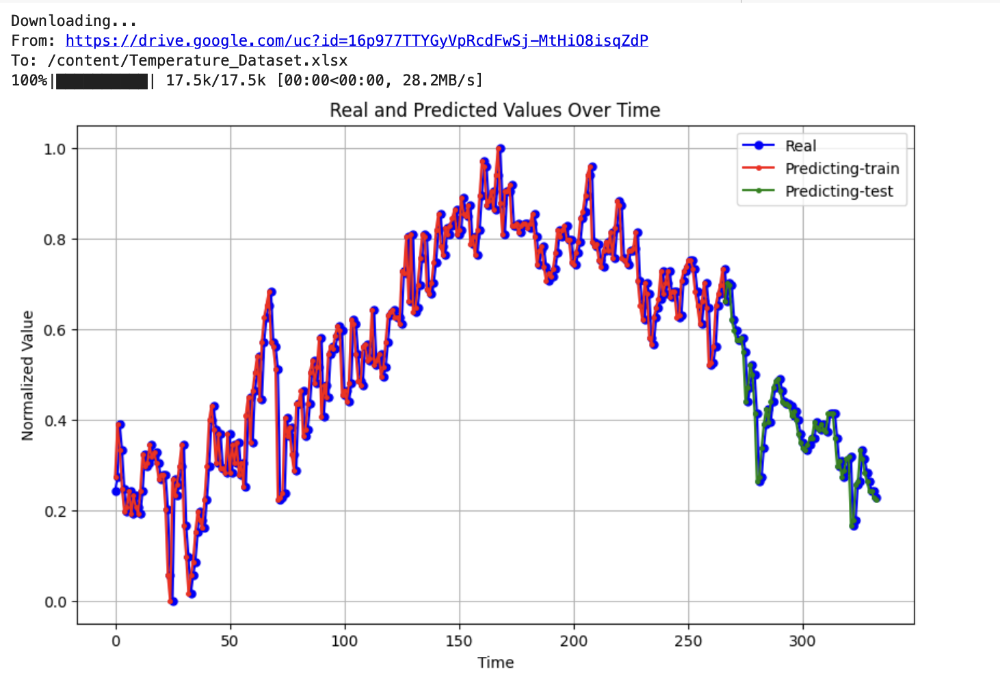
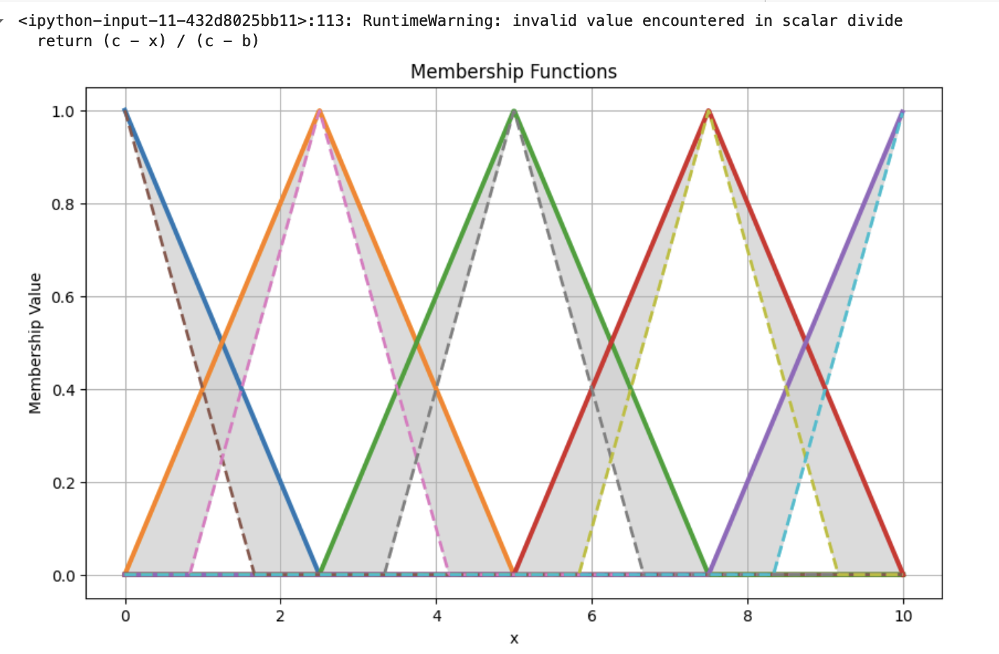

# Type II NeuroFuzzy Prediction System

## Description
This project implements a Type II NeuroFuzzy prediction system that utilizes a NeuroFuzzy approach to predict temperature data. The system employs a combination of normalized data processing, Mamdani NeuroFuzzy Type I inference system, and plotting of real and predicted values over time.

## Installation
Instructions on how to set up and run the project.

```bash
# Clone the repository
git clone https://your-repository-url.git

# Navigate to the project directory
cd NeuroFuzzy-Type-II

# Install required libraries
pip install pandas numpy matplotlib scikit-learn gdown
```

## Usage
How to run the scripts and generate predictions.

```python
# Import the main module
from neurofuzzy import TypeIINeuroFuzzy

# Initialize the system
fis = TypeIINeuroFuzzy('path_to_dataset')

# Run predictions
fis.predict()

# Plot results
fis.plot_results()
```

## Code Overview
Explanation of the code's components and their functions.

### Code 1: Data Normalization and Setup
This part of the code handles downloading the dataset, performing min-max normalization, and preparing the data for training and testing.

### Code 2: Definition of NeuroFuzzy System
Sets up the NeuroFuzzy system, defines membership functions, and computes the product of membership functions for inputs.

### Code 3: Plotting and Prediction
Generates plots for membership functions and predictions over time, illustrating the performance of the NeuroFuzzy system on training and test data.

## Plots
Visualizations of membership functions and predictions generated by the system.





## Contributing
How others can contribute to the project (optional).

## License
Specify the license under which the project is released (optional).
